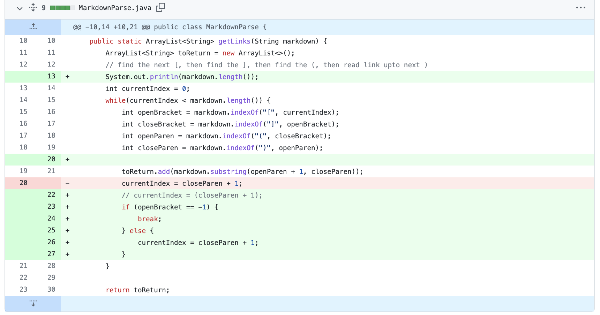
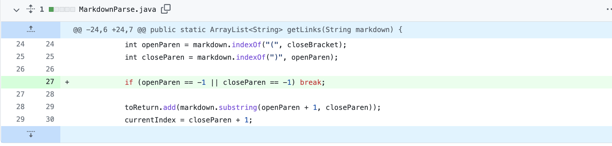
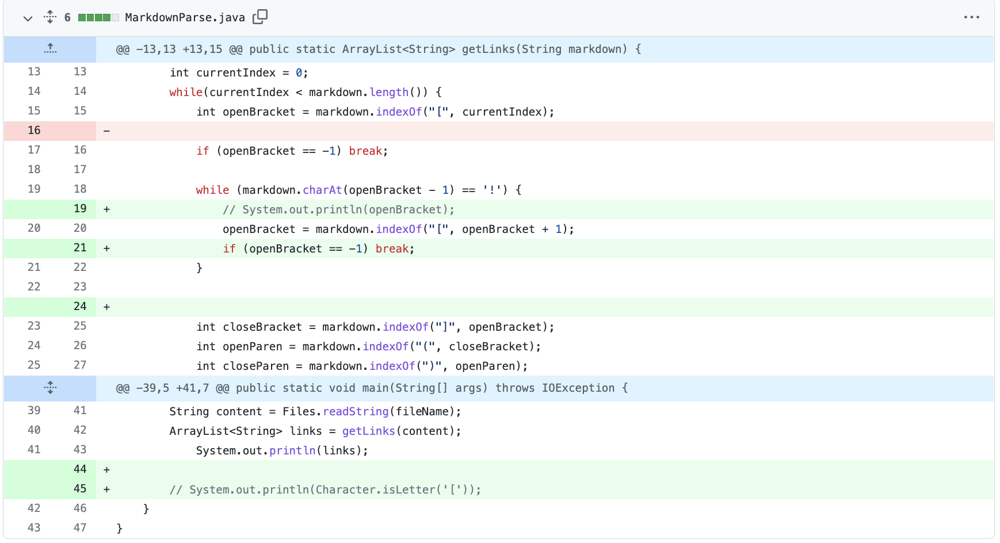

# Debugging Lab and three modifications on the code

1. **Infinite Loop**: When we tried [this file](https://github.com/kcyy127/markdown-parser/blob/main/test-file.md) on the programm, there was an infinite loop being generated. This is due to the fact that after the last close parenthesis' index is return, the value of currentIndex would stay -1 (unfound), and thus this always satisfies the prerequisite for entering the for loop. The following are the failure output: 

`xinghanwang@Xinghans-MacBook-Pro markdown-parser-main % java MarkdownParse test-file.md
Exception in thread "main" java.lang.OutOfMemoryError: Java heap space
        at java.base/java.util.Arrays.copyOfRange(Arrays.java:3822)
        at java.base/java.lang.StringLatin1.newString(StringLatin1.java:766)
        at java.base/java.lang.String.substring(String.java:2708)
        at MarkdownParse.getLinks(MarkdownParse.java:19)
        at MarkdownParse.main(MarkdownParse.java:30)`
        
 And the following the fix we made to the code: \
 
 
2. **Index Out of Bound**: When we ran [this file](https://github.com/kcyy127/markdown-parser/edit/main/test-file3.md) on the programm, which contains a half-link, there was an index out of bound exception being trhown, this is becuase when taking the substring from `openParen + 1` to `closeParen`, the index of `closeParen` can't be found in the last iteration. The following are the failure output:

`xinghanwang@Xinghans-MacBook-Pro markdown-parser-main % java MarkdownParse test-file3.md
Exception in thread "main" java.lang.StringIndexOutOfBoundsException: Range [81, -1) out of bounds for length 99
        at java.base/jdk.internal.util.Preconditions$1.apply(Preconditions.java:55)
        at java.base/jdk.internal.util.Preconditions$1.apply(Preconditions.java:52)
        at java.base/jdk.internal.util.Preconditions$4.apply(Preconditions.java:213)
        at java.base/jdk.internal.util.Preconditions$4.apply(Preconditions.java:210)
        at java.base/jdk.internal.util.Preconditions.outOfBounds(Preconditions.java:98)
        at java.base/jdk.internal.util.Preconditions.outOfBoundsCheckFromToIndex(Preconditions.java:112)
        at java.base/jdk.internal.util.Preconditions.checkFromToIndex(Preconditions.java:349)
        at java.base/java.lang.String.checkBoundsBeginEnd(String.java:4589)
        at java.base/java.lang.String.substring(String.java:2703)
        at MarkdownParse.getLinks(MarkdownParse.java:28)
        at MarkdownParse.main(MarkdownParse.java:39)`
        
 And the following the fix we made to the code: \
  
  
3. **A fake link**: When we ran [this file](https://github.com/kcyy127/markdown-parser/edit/main/test-file4.md) on the programm, which contains a fake link, the program still prints out the "fake link" in the output. This is because he program didn't take account into the `\` sign which falsify the validity of a link.  The following are the failure output:

`xinghanwang@Xinghans-MacBook-Pro markdown-parser-main % java MarkdownParse test-file4.md`\
`[fake_link, actual_link.html]`

And the following are the fix to the program:\
 

 
